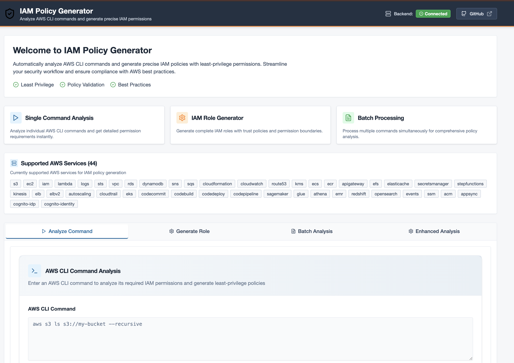

# AWS CLI IAM Permissions Analyzer

**Copyright (c) 2025 Jeff Pacheco JchecoPhotography. All rights reserved.**

A comprehensive tool that analyzes AWS CLI commands and generates the minimal IAM permissions required to execute them securely. This project helps developers, DevOps engineers, and security teams create least-privilege IAM roles and policies by automatically mapping AWS CLI workflows to precise permission requirements.

## 🌟 Key Features

- **Intelligent Command Analysis**: Advanced parsing of AWS CLI commands to extract services, actions, and resource ARNs
- **Comprehensive Permission Mapping**: Database of 52 AWS services with 300+ command mappings
- **Multiple Interfaces**: CLI tool, modern React web interface, and REST API
- **Enhanced Analysis Modes**: 
  - Standard batch analysis with comprehensive summaries
  - Resource-specific policy generation with precise ARN targeting
  - Least privilege optimization with security conditions
  - Service usage analysis with detailed breakdowns
- **Smart Role Generation**: Create complete IAM roles with appropriate trust policies
- **Multiple Output Formats**: Terraform, CloudFormation, AWS CLI, JSON, and YAML support
- **Advanced Web Interface**: Modern React frontend with enhanced batch analyzer and hot-reload development
- **Production Ready**: Fully containerized with Docker and Docker Compose support
- **Security Best Practices**: Automatic security condition injection and least privilege enforcement

## 🚀 Architecture Overview

This project provides three complementary interfaces:

### 1. Command Line Interface (CLI)
```bash
# Direct CLI usage for automation and scripting (requires PYTHONPATH)
PYTHONPATH=backend python -m iam_generator.main analyze s3 ls s3://my-bucket
PYTHONPATH=backend python -m iam_generator.main generate-role --role-name S3ReadRole s3 ls s3://my-bucket

# Or install as package first
cd backend && pip install -e .
iam-generator analyze s3 ls s3://my-bucket
iam-generator generate-role --role-name S3ReadRole s3 ls s3://my-bucket
```

### 2. Web Interface (Recommended)
Modern React frontend with shadcn/ui components for interactive analysis:



```bash
# Complete application stack with Docker
docker-compose up -d

# Access interfaces:
# Web UI: http://localhost:3000
# API: http://localhost:8000
# API Docs: http://localhost:8000/docs
```

### 3. REST API
FastAPI backend for programmatic integration:
```bash
curl -X POST "http://localhost:8000/analyze" \
  -H "Content-Type: application/json" \
  -d '{"command": "aws s3 ls s3://my-bucket"}'
```

## 📦 Installation & Deployment

### Option 1: Docker Deployment (Recommended)

The project includes a complete containerized stack with production-ready configuration:

```bash
# Clone the repository
git clone https://github.com/jpacheco87/iam_generator.git
cd iam_generator

# Production deployment
make start
# OR: docker-compose up -d

# Development environment
make dev
# OR: docker-compose -f docker-compose.dev.yml up -d

# 🔥 HOT RELOAD FEATURES:
# Backend: Automatic Python code reloading with uvicorn --reload
# Frontend: Vite HMR (Hot Module Replacement) for instant updates
# Volume mounts: ./backend/app:/app/app and ./backend/iam_generator:/app/iam_generator

# View service status
make status

# View logs
make logs
```

**Available Make Commands:**
- `make build` - Build Docker images
- `make start` - Start production environment  
- `make dev` - Start development environment
- `make stop` - Stop all services
- `make restart` - Restart services
- `make status` - Show service status
- `make logs` - Show service logs
- `make health` - Check service health
- `make cleanup` - Clean up resources

### Option 2: Local Development Setup

```bash
# Install Python dependencies
cd backend
pip install -r requirements.txt
pip install -e .

# Now you can use the CLI without PYTHONPATH
iam-generator --help

# Or use with PYTHONPATH from project root
PYTHONPATH=backend python -m iam_generator.main --help

# Optional: Install frontend dependencies
cd ../frontend
npm install
npm run build
```

## 🎯 Quick Start Examples

### Analyze Individual Commands
```bash
# S3 operations analysis
PYTHONPATH=backend python -m iam_generator.main analyze s3 sync s3://source/ s3://dest/ --delete

# EC2 management with JSON output
PYTHONPATH=backend python -m iam_generator.main analyze --output json ec2 run-instances --image-id ami-12345

# Lambda function analysis
PYTHONPATH=backend python -m iam_generator.main analyze lambda create-function --function-name test

# Or with installed package
iam-generator analyze s3 sync s3://source/ s3://dest/ --delete
iam-generator analyze --output json ec2 run-instances --image-id ami-12345
iam-generator analyze lambda create-function --function-name test
```

### Generate IAM Roles
```bash
# Basic S3 role
PYTHONPATH=backend python -m iam_generator.main generate-role --role-name S3ReadRole s3 ls s3://my-bucket

# Lambda execution role with Terraform output
PYTHONPATH=backend python -m iam_generator.main generate-role \
  --role-name LambdaExecutionRole \
  --trust-policy lambda \
  --output-format terraform \
  lambda invoke --function-name my-function

# Cross-account access role
PYTHONPATH=backend python -m iam_generator.main generate-role \
  --role-name CrossAccountRole \
  --trust-policy cross-account \
  --account-id 123456789012 \
  s3 ls s3://shared-bucket

# Or with installed package
iam-generator generate-role --role-name S3ReadRole s3 ls s3://my-bucket
iam-generator generate-role \
  --role-name LambdaExecutionRole \
  --trust-policy lambda \
  --output-format terraform \
  lambda invoke --function-name my-function
```

### Batch Analysis
```bash
# Create command list file
cat > commands.txt << EOF
s3 ls s3://bucket1
s3 cp file.txt s3://bucket2/
ec2 describe-instances
lambda list-functions
dynamodb scan --table-name MyTable
EOF

# Analyze all commands with detailed output
PYTHONPATH=backend python -m iam_generator.main batch-analyze commands.txt --output-dir ./results

# Or with installed package
iam-generator batch-analyze commands.txt --output-dir ./results
```

## 🔧 Advanced Features

### Enhanced Analysis Modes (✅ Fully Implemented)
The tool now supports multiple analysis modes through both CLI and web interface:

#### 1. Resource-Specific Policy Generation
Generate policies with specific ARN patterns instead of wildcards:

```bash
# CLI usage
PYTHONPATH=backend python -m iam_generator.main analyze s3 cp s3://my-bucket/file.txt ./local-file
PYTHONPATH=backend python -m iam_generator.main analyze ec2 terminate-instances --instance-ids i-1234567890abcdef0

# Or with installed package
iam-generator analyze s3 cp s3://my-bucket/file.txt ./local-file
iam-generator analyze ec2 terminate-instances --instance-ids i-1234567890abcdef0

# API usage
curl -X POST "http://localhost:8000/analyze-resource-specific" \
  -H "Content-Type: application/json" \
  -d '{
    "commands": ["aws s3 ls s3://my-bucket", "aws ec2 describe-instances --instance-ids i-1234567890abcdef0"],
    "account_id": "123456789012",
    "region": "us-east-1",
    "strict_mode": true
  }'
```

#### 2. Least Privilege Policy Optimization
Generate minimal required permissions with enhanced security conditions:

```bash
# CLI usage
PYTHONPATH=backend python -m iam_generator.main generate-role \
  --role-name OptimizedRole \
  --least-privilege \
  s3 ls s3://bucket \
  s3 cp s3://bucket/file.txt ./file \
  ec2 describe-instances

# Or with installed package
iam-generator generate-role \
  --role-name OptimizedRole \
  --least-privilege \
  s3 ls s3://bucket \
  s3 cp s3://bucket/file.txt ./file \
  ec2 describe-instances

# API usage
curl -X POST "http://localhost:8000/analyze-least-privilege" \
  -H "Content-Type: application/json" \
  -d '{
    "commands": ["aws s3 ls s3://my-bucket", "aws ec2 describe-instances"],
    "account_id": "123456789012",
    "region": "us-east-1"
  }'
```

#### 3. Service Usage Summary Analysis
Get comprehensive breakdown of AWS services, actions, and permissions:

```bash
# CLI usage
PYTHONPATH=backend python -m iam_generator.main service-summary \
  s3 ls s3://bucket \
  ec2 describe-instances \
  lambda list-functions

# Or with installed package
iam-generator service-summary \
  s3 ls s3://bucket \
  ec2 describe-instances \
  lambda list-functions

# API usage
curl -X POST "http://localhost:8000/service-summary" \
  -H "Content-Type: application/json" \
  -d '{
    "commands": ["aws s3 ls s3://my-bucket", "aws ec2 describe-instances", "aws lambda list-functions"]
  }'
```

### Enhanced Web Interface Features
- **Interactive Analysis Modes**: Switch between standard, resource-specific, least privilege, and service summary analysis
- **Real-time Results**: View detailed policy documents, metadata, and statistics
- **Export Capabilities**: Download generated policies in multiple formats
- **Hot Reload Development**: Full development environment with automatic code reloading
# Get comprehensive service usage analysis
iam-generator service-summary \
  s3 ls s3://bucket \
  ec2 describe-instances \
  lambda list-functions
```

## 📊 Supported AWS Services

**52 AWS Services** with comprehensive command coverage:

| Service Category | Services | Commands |
|------------------|----------|----------|
| **Core Services** | S3, EC2, IAM, Lambda | 50+ |
| **AI/ML Services** | Bedrock, Bedrock Runtime, Textract, Rekognition, Comprehend, Polly, Transcribe, Translate | 19+ |
| **Container Services** | ECS, ECR, EKS | 25+ |
| **DevOps & CI/CD** | CodeCommit, CodeBuild, CodeDeploy, CodePipeline | 35+ |
| **Data & Analytics** | SageMaker, Glue, Athena, EMR, Redshift, OpenSearch, Kinesis | 60+ |
| **Database Services** | RDS, DynamoDB, ElastiCache | 15+ |
| **Networking** | VPC, Route53, ELB/ELBv2, Auto Scaling | 20+ |
| **Security Services** | KMS, Secrets Manager, ACM, Cognito (User Pools & Identity) | 25+ |
| **Application Services** | SNS, SQS, API Gateway, Step Functions, AppSync | 30+ |
| **Management** | CloudFormation, CloudWatch, CloudTrail, EventBridge, Systems Manager | 35+ |
| **Storage** | EFS | 5+ |
| **Identity** | STS | 2+ |

**Complete service list:**
```bash
# View all supported services and their commands
PYTHONPATH=backend python -m iam_generator.main list-services

# Or with installed package
iam-generator list-services
```

## 🔑 Output Formats

### 1. Terraform
```bash
PYTHONPATH=backend python -m iam_generator.main generate-role --output-format terraform --role-name MyRole s3 ls
# Or: iam-generator generate-role --output-format terraform --role-name MyRole s3 ls
```

### 2. CloudFormation
```bash
PYTHONPATH=backend python -m iam_generator.main generate-role --output-format cloudformation --role-name MyRole s3 ls
# Or: iam-generator generate-role --output-format cloudformation --role-name MyRole s3 ls
```

### 3. AWS CLI
```bash
PYTHONPATH=backend python -m iam_generator.main generate-role --output-format aws-cli --role-name MyRole s3 ls
# Or: iam-generator generate-role --output-format aws-cli --role-name MyRole s3 ls
```

### 4. JSON Policy
```bash
PYTHONPATH=backend python -m iam_generator.main analyze --output json s3 cp file.txt s3://bucket/
# Or: iam-generator analyze --output json s3 cp file.txt s3://bucket/
```

### 5. YAML
```bash
PYTHONPATH=backend python -m iam_generator.main analyze --output yaml ec2 describe-instances
# Or: iam-generator analyze --output yaml ec2 describe-instances
```

## 🛠️ Development Setup

### Project Structure
```
iam_generator/
├── backend/                    # Python backend
│   ├── iam_generator/          # Core Python package
│   │   ├── analyzer.py         # Permission analysis engine
│   │   ├── parser.py           # AWS CLI command parser
│   │   ├── permissions_db.py   # Permission database (52 services)
│   │   ├── role_generator.py   # IAM role generator
│   │   └── cli.py              # CLI interface
│   ├── app/                    # FastAPI web application
│   │   ├── main.py             # FastAPI app setup
│   │   ├── models.py           # API schemas
│   │   ├── services.py         # Business logic
│   │   ├── routers/            # API endpoints
│   │   └── core/               # Configuration
│   ├── requirements.txt        # Python dependencies
│   └── README.md               # Backend documentation
├── frontend/                   # React TypeScript frontend
│   ├── src/components/         # UI components (shadcn/ui)
│   └── src/lib/               # API client and utilities
├── tests/                      # Comprehensive test suite
├── docker-compose.yml          # Production deployment
├── docker-compose.dev.yml      # Development environment
├── Makefile                    # Development commands
└── docs/                       # Documentation and examples
```

### Running Tests
```bash
# Run full test suite
PYTHONPATH=backend pytest

# Run specific test categories
PYTHONPATH=backend pytest tests/test_analyzer.py      # Core analysis tests
PYTHONPATH=backend pytest tests/test_parser.py        # CLI parsing tests
PYTHONPATH=backend pytest tests/test_permissions_db.py # Database tests
PYTHONPATH=backend pytest tests/test_integration.py   # Integration tests

# Run with coverage
PYTHONPATH=backend pytest --cov=iam_generator --cov-report=html
```

### API Endpoints

The FastAPI backend provides these endpoints:

**Core Analysis:**
- `POST /analyze` - Analyze single AWS CLI command
- `POST /batch-analyze` - Analyze multiple commands with comprehensive results
- `POST /generate-role` - Generate IAM role configuration  
- `GET /services` - List supported AWS services

**Enhanced Analysis (✅ Fully Implemented):**
- `POST /analyze-resource-specific` - Generate resource-specific policies with precise ARNs
- `POST /analyze-least-privilege` - Generate minimal permission policies with security conditions
- `POST /service-summary` - Get detailed service usage summary and statistics

**Utility:**
- `GET /health` - Health check endpoint
- `GET /docs` - Interactive API documentation (Swagger UI)

All endpoints support comprehensive request/response validation and detailed error handling.

## 🔒 Trust Policy Types

### EC2 Instance Profile
```json
{
  "Version": "2012-10-17",
  "Statement": [
    {
      "Effect": "Allow",
      "Principal": {"Service": "ec2.amazonaws.com"},
      "Action": "sts:AssumeRole"
    }
  ]
}
```

### Lambda Execution Role
```json
{
  "Version": "2012-10-17",
  "Statement": [
    {
      "Effect": "Allow",
      "Principal": {"Service": "lambda.amazonaws.com"},
      "Action": "sts:AssumeRole"
    }
  ]
}
```

### Cross-Account Access
```json
{
  "Version": "2012-10-17",
  "Statement": [
    {
      "Effect": "Allow",
      "Principal": {"AWS": "arn:aws:iam::ACCOUNT-ID:root"},
      "Action": "sts:AssumeRole"
    }
  ]
}
```

## 📈 Production Deployment

### Docker Compose Stack
The project includes production-ready deployment with:

- **Backend**: FastAPI server with Python 3.12
- **Frontend**: React TypeScript app with Vite
- **Reverse Proxy**: Nginx configuration
- **Health Checks**: Automated service monitoring
- **Persistent Storage**: Data and logs volumes
- **Security**: Non-root user, proper file permissions

### Environment Configuration
```bash
# Production environment variables
PORT=8000
PYTHONPATH=/app/src
LOG_LEVEL=info

# Optional AWS credentials (for development)
# AWS_ACCESS_KEY_ID=your_access_key
# AWS_SECRET_ACCESS_KEY=your_secret_key
```

## 🤝 Contributing

1. Fork the repository
2. Create a feature branch (`git checkout -b feature/amazing-feature`)
3. Make your changes following the coding guidelines
4. Add tests for new functionality
5. Run the test suite (`pytest`)
6. Commit your changes (`git commit -m 'Add amazing feature'`)
7. Push to the branch (`git push origin feature/amazing-feature`)
8. Open a Pull Request

**Development Guidelines:**
- Follow Python PEP 8 style guidelines
- Use type hints for all function parameters and return values
- Include comprehensive docstrings for classes and functions
- Implement proper error handling and logging
- Focus on AWS IAM security best practices

## 📄 License

This project is proprietary software. All rights reserved. See the [LICENSE](LICENSE) file for complete terms and conditions.

**Important**: This software is protected by copyright and proprietary license terms. Commercial use requires a separate license agreement. Contact the copyright holder for licensing inquiries.

## 📞 Support & Contact

- **Documentation**: Check the [docs/](docs/) directory for detailed documentation
- **Issues**: Report bugs and request features via GitHub Issues
- **Examples**: See [docs/examples.md](docs/examples.md) for more usage examples
- **License Inquiries**: jcheco731@gmail.com

## 🚀 Roadmap

**✅ Recently Completed (2025):**
- ✅ Support for 52 AWS services with 300+ commands
- ✅ Modern React web interface with shadcn/ui components
- ✅ FastAPI REST API backend with comprehensive endpoints
- ✅ Multiple output formats (Terraform, CloudFormation, AWS CLI, JSON, YAML)
- ✅ Batch processing capabilities with detailed analysis
- ✅ Resource-specific ARN generation for enhanced security
- ✅ Docker containerization with production-ready deployment
- ✅ Comprehensive test suite with CI/CD integration
- ✅ **Enhanced Analysis Features**: Resource-specific policies, least privilege optimization, service summaries
- ✅ **Hot Reload Development Environment**: Full Docker development stack with automatic code reloading
- ✅ **Advanced Web Interface**: Enhanced batch analyzer with multiple analysis modes
- ✅ **Complete Enhanced Analysis Implementation**: All advanced endpoints fully functional with real data analysis

**🚀 Next Phase - Advanced Features:**
- [ ] **Conditional IAM policies**: Add support for IAM conditions based on command parameters
- [ ] **Policy validation engine**: Check policies against AWS limits and best practices
- [ ] **Cross-service dependency analysis**: Auto-include dependent permissions
- [ ] **Integration with AWS IAM Access Analyzer**: Validate against AWS recommendations
- [ ] **VS Code extension**: Direct integration into development workflows
- [ ] **Custom permission mappings**: User-defined service definitions
- [ ] **Policy optimization**: Merge similar permissions and reduce complexity
- [ ] **Audit and compliance reports**: Generate security compliance documentation
- [ ] **Multi-account support**: Enhanced cross-account access patterns
- [ ] **CloudFormation template generation**: Direct infrastructure-as-code output

---

**Built with ❤️ by [Jeff Pacheco](mailto:jcheco731@gmail.com)**
